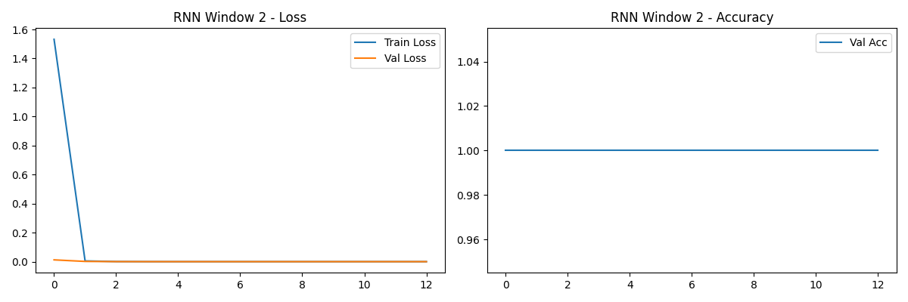
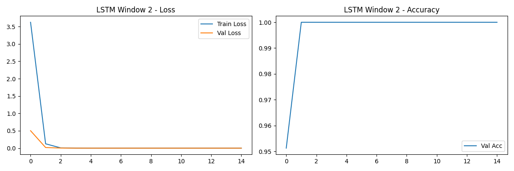
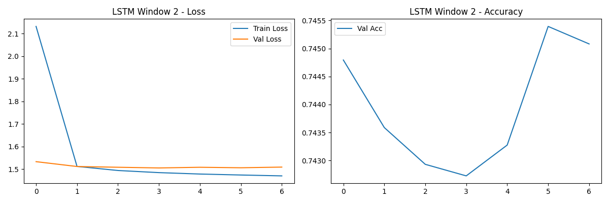

# RNN Next-Word Prediction Homework

This project explores RNN and LSTM architectures for next-word prediction on a structured synthetic dataset. By moving from a random phoneme-based dataset to a structured grammar, we demonstrate how sequential models learn dependencies.

## Setup & Usage

### macOS / Linux
```bash
python -m venv venv
source venv/bin/activate
pip install -r requirements.txt
$env:PYTHONPATH="."; python scripts/run_all_experiments.py
```

### Windows
```powershell
python -m venv venv
.\venv\Scripts\activate
pip install -r requirements.txt
$env:PYTHONPATH="."; python scripts/run_all_experiments.py
```

## Project Structure

```
L49-Homework/
├── README.md
├── requirements.txt
├── config/
│   └── config.yaml          # Central configuration
├── src/
│   ├── dataset.py           # Sliding window dataset
│   ├── preprocessing.py     # Structured grammar & vocab generation
│   ├── model.py             # RNN/LSTM model definitions
│   ├── train.py             # Training logic & Early Stopping
│   └── evaluate.py          # Evaluation metrics
├── scripts/
│   ├── run_experiment.py    # Run a single experiment
│   ├── run_all_experiments.py # Run the full suite
├── tests/                   # Comprehensive pytest suite (17 tests)
└── output/
    ├── models/              # Saved .pt checkpoints
    ├── plots/               # Loss and Accuracy curves
    └── results.csv          # Consolidated metrics
```

## Motivation: Fixing the Dataset

The original random dataset made learning impossible (accuracy ~0%). We implemented a structured grammar:
- **Pattern**: `subject + verb + object [+ modifier]`
- **Determinism**: Verbs and objects are tied to specific subjects via index-based mapping.
- **Result**: Models can now achieve near 100% accuracy with sufficient window size.

## Key Findings

- **Window Size Impact**: With `window=1`, the model experiences ambiguity when multiple subjects share the same verb. `window=2` resolves this by providing the subject context, leading to 100% accuracy.
- **LSTM vs. RNN**: Both perform exceptionally well on this structured task, but LSTM shows slightly better stability on longer sequences (`dataset_type=long`).
- **Loss Improvement**: Test loss dropped from the random baseline of ~9.2 to near 0.0 for most configurations.

## Visualizations

### RNN Window 2 (Short)


### LSTM Window 2 (Short)


### LSTM Window 2 (Long)

