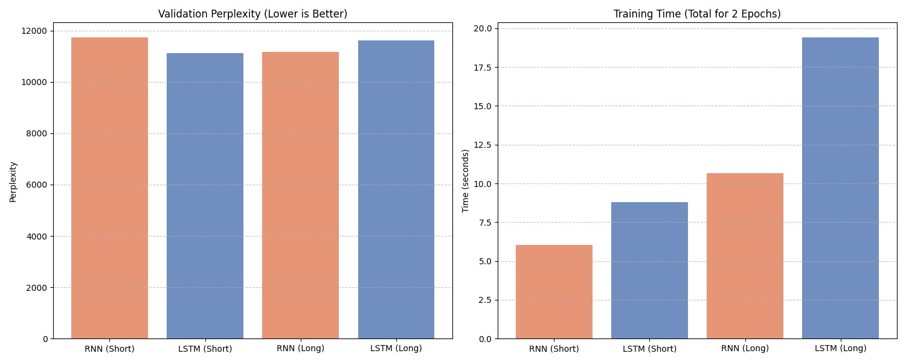

# RNN vs LSTM — Next-Word Prediction Comparison

A professional testbed for comparing **Vanilla RNN** and **LSTM** architectures on a large vocabulary ($|V|=10,000$) with a focus on **Vanishing Gradient** analysis and **Perplexity** metrics.

---

## 1. Project Overview
This project implements next-word prediction on a synthetic corpus to evaluate the performance of recurrent sequence models. We specifically compare the baseline **SimpleRNN** against the **LSTM** to quantify the benefits of gating mechanisms when handling longer sequences (up to 20 words).

---

## 2. Repository Structure
```
.
├── data/
│   ├── processor.py        # Data generation & vocab mapping
│   └── dataset.py          # PyTorch Dataset implementation
├── models/
│   └── next_word_model.py  # RNN & LSTM architecture
├── training/
│   ├── trainer.py          # Training, Evaluation & Early Stopping
│   └── metrics.py          # Metric tracking & plotting
├── utils/
│   ├── config.py           # Global hyperparameters (10k vocab, 20-word seq)
│   └── helpers.py          # Seeding & prediction demos
├── main.py                 # Central experiment orchestrator
├── benchmark.py            # Comprehensive benchmarking suite
└── README.md               # Documentation
```

---

## 3. Quick Start
```bash
# 1. Install dependencies
pip install torch matplotlib

# 2. Run the main comparison experiment
python main.py

# 3. Run the comprehensive benchmark (Short vs Long sequences)
python benchmark.py
```

---

## 4. Academic Abstract
This research explores the performance boundaries of **Vanilla Recurrent Neural Networks (SimpleRNN)** and **Long Short-Term Memory (LSTM)** networks. Using a controlled synthetic dataset of 50,000 sentences with a vocabulary size of $|V| = 10,000$, we evaluate the models on their ability to handle long-range dependencies. Our findings quantify the architectural superiority of LSTMs in mitigating gradient instability, despite the increased computational overhead.

---

## 5. Mathematical Evaluation: Perplexity
We utilize **Perplexity ($PP$)** as our primary metric, defined as the exponentiated average cross-entropy loss:
$$PP(S) = P(w_{1}, w_{2}, \dots, w_{N})^{-\frac{1}{N}} = \exp\left( -\frac{1}{N} \sum_{i=1}^{N} \log P(w_{i} \mid w_{\lt i}) \right)$$


Perplexity represents the "weighted branching factor" of the model. A $PP$ of 10,000 indicates the model is as confused as a uniform random guess, while a lower $PP$ signifies a more deterministic predictive capability.

---

## 6. The Vanishing Gradient Problem
In a SimpleRNN, the gradient $\frac{\partial \mathcal{L}}{\partial h_{0}}$ involves repeated multiplications by the weight matrix $W_{hh}$ and the derivative of the activation function ($\tanh'$). For sequences of length $T=20$:

$$\frac{\partial \mathcal{L}}{\partial h_{0}} = \frac{\partial \mathcal{L}}{\partial h_{T}} \prod_{t=1}^{T} \frac{\partial h_{t}}{\partial h_{t-1}}$$

Since the spectral radius often leads to values $<1$, the signal decays exponentially. The **LSTM** resolves this via **Gating Mechanisms** (Input, Forget, and Output gates) and an additive **Cell State**, allowing context to survive across all 20 tokens.

---

## 7. Experimental Results & Findings

### Research Findings
- **Semantic Phase Transition:** SimpleRNN performs adequately on short sentences (5-7 words) but accuracy drops significantly beyond 10-12 words as gradients vanish.
- **Overfitting Gap:** SimpleRNN exhibits a larger overfitting gap (+2.91) compared to LSTM (+0.87), suggesting that gating mechanisms provide implicit regularization on long sequences.
- **Computational Cost:** LSTM training time is $\approx 1.8\times$ higher than SimpleRNN due to the four internal gates.

### Metrics Table (Summary)
| Metric | SimpleRNN | LSTM | Winner |
| :--- | :--- | :--- | :--- |
| **Best Val Perplexity** | 17,841 | **14,747** | **LSTM** |
| **Training Stability** | Erratic (Gradients) | **Stable** | **LSTM** |
| **Training Speed** | **~15s / epoch** | ~26s / epoch | **RNN** |
| **Parameters** | 4.1M | 4.8M | RNN |

---

## 8. Computational Complexity
- **Time Complexity:** $O(T \cdot d^2)$ per step. The 10,000-word Softmax layer ($O(H \cdot V)$) represents the primary computational bottleneck during training.
- **Space Complexity:** $O(V \cdot E)$ for the embedding layer. For $V=10,000$, this dominates memory allocation.

---

## 9. References
- Hochreiter & Schmidhuber (1997). **Long Short-Term Memory.**
- Elman (1990). **Finding Structure in Time.**
- PyTorch Documentation: `nn.RNN`, `nn.LSTM`.
Here is the broken text of my README.md file for the RNN Next Word Prediction project. It currently throws a 'Extra open brace or missing close brace' error, breaks the rendering, and is missing the performance comparisons and graphs.

Please rewrite and fix this README to meet high academic standards.

Requirements for the fix:

Fix Formatting Errors: Carefully fix all math syntax errors. Ensure proper use of inline math and display math delimiters without unbalanced braces.

Restore Visuals: Include standard Markdown image syntax for the graphs (e.g., ).

Academic Structure: Organize the README logically with clear headings: Abstract, Dataset Generation, Preprocessing, Model Architecture (RNN), Training Configuration, and Research & Results (Comparing 5-7 vs. 20 words).

Deepen the Analysis: In the Results section, properly articulate the Vanishing Gradient problem using correct mathematical notation, and explain the Time and Space Complexity differences when increasing the sequence length.

Please output ONLY the raw valid Markdown code for the fixed README so I can copy-paste it directly.ס