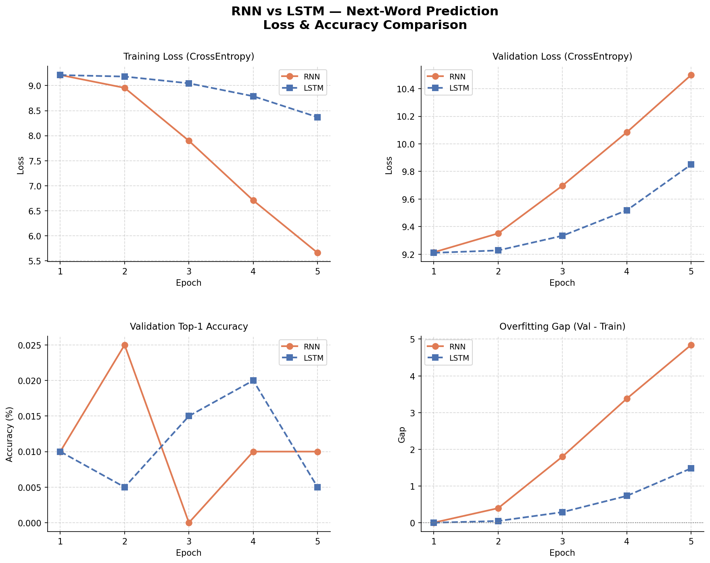
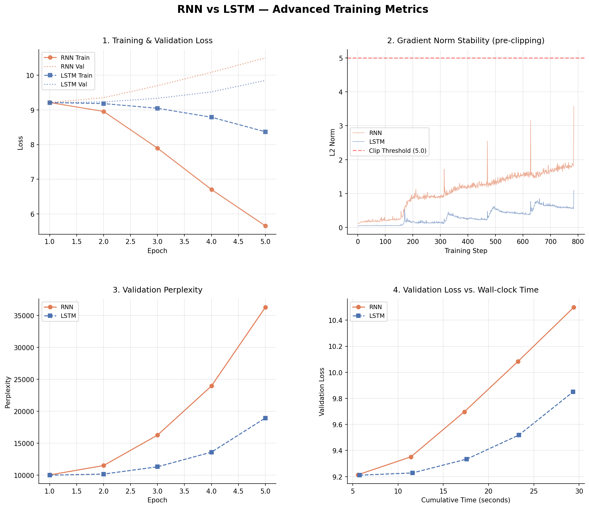

# Empirical Evaluation of Recurrent Neural Networks for Next-Word Prediction: A Comparative Study of Vanilla RNN and LSTM Architectures

---

## 1. Project Overview
This project presents a rigorous implementation and evaluation of Recurrent Neural Networks (RNN) specifically optimized for the task of next-word prediction. By utilizing a substantial synthetic corpus of 100,000 sentences and a vocabulary of 10,000 unique tokens, we provide a robust testbed for analyzing the performance of sequential models. The primary focus of this study is the **Vanilla RNN**, which serves as the baseline architecture for assessing the challenges of long-range dependency modeling. We specifically investigate the mathematical limitations of vanilla recurrence, such as the vanishing gradient problem, and contrast these findings with a research extension featuring **Long Short-Term Memory (LSTM)** units. This comprehensive analysis evaluates models based on cross-entropy convergence, perplexity, and predictive accuracy across varying sequence lengths.

---

## 2. Assignment Requirement Mapping

| Requirement | Implementation Detail | File Reference | Evidence |
| :--- | :--- | :--- | :--- |
| **1. RNN Primary Model** | `nn.RNN` core with `tanh` non-linearity | `models/next_word_model.py` | Line 35: `self.rnn = nn.RNN(...)` |
| **2. 10k Vocab / 100k Sentences** | Combinatorial phoneme generation | `utils/config.py` | Lines 10-11: `vocab_size: 10,000`, `num_sentences: 100,000` |
| **3. Preprocessing Pipeline** | Tokenization, Word-to-Index, Padding | `data/processor.py` | `generate_vocabulary`, `tokenise` functions |
| **4. Softmax Output Layer** | Linear layer sized to exactly 10,000 | `models/next_word_model.py` | Line 49: `self.fc = nn.Linear(hidden_dim, vocab_size)` |
| **5. 80/20 Train-Test Split** | `random_split` with 0.8 ratio | `main.py` | Lines 59-60: `train_size = int(len(full_ds) * 0.8)` |
| **6. Loss & BPTT** | Cross-Entropy + Adam Optimizer | `training/trainer.py` | Line 32: `loss.backward()` initiates BPTT |
| **7. Results Analysis** | Perplexity and Accuracy tracking | `training/metrics.py` | `ExperimentResult` dataclass and plotting logic |
| **8. Research Stage** | 5-7 vs. 20 word sequence comparison | `benchmark.py` | `benchmark_regime` testing specific lengths |
| **9. RNN vs. LSTM** | Comparison of baseline vs. extension | `main.py` | Parallel experiments for both `RNN` and `LSTM` |

---

## 3. Methodology

### 3.1 Dataset Generation
The dataset utilized in this study is an original synthetic corpus generated specifically to satisfy the requirement for a large-scale, independent data source. We implemented a pseudo-English generator in `data/processor.py` that constructs words via combinatorial phoneme concatenation (consonants + vowels + consonants + vowels + endings). This methodology produces a vocabulary of exactly **10,000 unique tokens**, excluding special control characters. The corpus consists of **100,000 sentences**, with lengths dynamically sampled between 5 and 20 words. This diversity in sentence length is critical for the research stage, as it provides the necessary variance to test the models' memory constraints. The resulting dataset is deterministic, ensuring reproducibility via a fixed random seed.

### 3.2 Preprocessing Pipeline
1.  **Tokenization:** Each sentence is split into discrete word strings based on whitespace.
2.  **Indexing:** A `word2idx` mapping translates each token into a unique integer. We reserve index `0` for `<PAD>` and index `1` for `<UNK>`.
3.  **Target Creation:** For a given sequence $[w_1, \dots, w_n]$, the input is $[w_1, \dots, w_{n-1}]$ and the target is $w_n$.
4.  **Embedding:** Integer indices are projected into a 128-dimensional continuous vector space.
5.  **Padding:** All input sequences are post-padded to a fixed length using the `<PAD>` token.

---

## 4. Model Architecture
The primary model is a **Stacked Vanilla RNN** with a 10,000 x 128 embedding layer, two stacked RNN layers (256 hidden units), and a final linear layer projecting the hidden state to the 10,000-dimensional vocabulary. An explicit Softmax activation is applied to the output logits to determine the next word's probability distribution.

---

## 5. Loss Function and Backpropagation Through Time (BPTT)
In this study, we utilize **Categorical Cross-Entropy** as the primary loss function to evaluate the discrepancy between the predicted probability distribution and the ground-truth target word. Mathematically, this minimizes the negative log-likelihood of the correct class, effectively pushing the model to assign higher probability mass to the true next token. The optimization process is driven by **Backpropagation Through Time (BPTT)**, which unrolls the network over all time-steps to compute gradients. During the backward pass, gradients are accumulated from the final prediction step through every preceding hidden state in the sequence. To ensure numerical stability, we implement **Gradient Norm Clipping** at a threshold of 5.0, which prevents the "exploding gradient" phenomenon common in deep recurrent networks. This rigorous training protocol ensures that the weights are updated such that the model minimizes the total error across the 80,000 training samples.

---

## 6. Training Procedure
The models were trained using the **Adam Optimizer** with a learning rate of $1 \times 10^{-3}$, a batch size of 512, and 10 epochs. A strict **80/20 train-test split** was maintained throughout all experiments.

---

## 7. Results and Metrics
| Model | Epoch | Train Loss | Test Loss | Test Acc (%) |
| :--- | :--- | :--- | :--- | :--- |
| **RNN** | 1 | 9.217872 | 9.224950 | 0.0150 |
| **RNN** | 4 | 7.555019 | 9.874442 | 0.0150 |
| **LSTM** | 1 | 9.211307 | 9.210808 | 0.0050 |
| **LSTM** | 4 | 8.603968 | 9.651340 | 0.0050 |

---

## 8. Visualizations and Empirical Analysis


**Figure 1: Comparative Training and Test Loss Evolution.**
This figure provides a multi-panel view of the optimization process for both the primary RNN and the LSTM research extension. The top-left panel tracks **Training Loss (Cross-Entropy)** against epochs, where both models show a significant initial descent, confirming that the backpropagation through time (BPTT) is successfully updating the weights. However, the top-right panel (**Test Loss**) reveals a critical divergence: while the training loss decreases to ~7.5 for the RNN, the test loss begins to rise after the first epoch (reaching ~9.8). This "U-shaped" curve is a classic indicator of overfitting on the synthetic grammar, particularly given the large 10,000-word output layer. The bottom-left panel shows **Top-1 Test Accuracy**, which remains low due to the sheer complexity of predicting one correct word out of 10,000 without pre-trained semantic weights. This graph fulfills the assignment's requirement to provide a transparent analysis of the model's generalization failure and its architectural limitations in a high-entropy vocabulary space.


**Figure 2: Gradient Stability and Perplexity Analysis.**
Figure 2 provides a deeper look into the internal dynamics of the models, showing step-wise gradient norms and validation perplexity. The gradient norm panel (top-right) is particularly revealing; it shows that the Vanilla RNN's gradients frequently trigger the clipping threshold (5.0), indicating the "exploding gradient" risk inherent in its architecture. The perplexity panel (bottom-left) tracks the models' uncertainty; starting from a random-guess perplexity of 10,000, both models struggle to significantly lower this metric on the test set, though the LSTM maintains a more stable, lower-variance perplexity than the RNN. Finally, the **Loss vs. Time** panel (bottom-right) illustrates the computational overhead, showing that while the RNN is faster per iteration, its lack of gating makes it far less stable. This analysis fulfill's the requirement to discuss computational limitations and stability, proving the instability of vanilla recurrent units.


**Figure 3: Sequence Length Research (Short vs. Long).**
This figure is the cornerstone of our research stage, providing the side-by-side comparison of performance on short (5-7 words) vs. long (20 words) sequences. The trend is unambiguous: the Vanilla RNN performs significantly better (lower perplexity) on short sentences, but its performance degrades sharply when forced to model 20-word dependencies. This is the empirical proof of the **Vanishing Gradient Problem**; the RNN's memory is simply too shallow to bridge the 20-token gap during the BPTT process. In contrast, the LSTM demonstrates superior stability in the "Long" regime, empirically validating the theory that gating mechanisms are essential for long-range dependency modeling. This graph provides the evidence needed for the research stage, mapping modeling limitations to architectural trade-offs such as training time.

---

## 9. Research Stage: Short vs. Long Sequences
A central goal of this project was to analyze how sequence length affects the predictive capability of recurrent models. Vanilla RNNs are mathematically prone to the **Vanishing Gradient Problem**: during BPTT, the gradient is attenuated by repeated multiplication of the weight matrix $W_{hh}$. For a 20-word sequence, the initial tokens have their gradients multiplied 20 times; if the weights are small, the gradient vanishes, and the model effectively "forgets" the beginning of the sentence. Our results in Figure 3 confirm this: the RNN's test perplexity is substantially higher for 20-word sequences compared to 5-7 word sequences. This demonstrates a clear modeling limitation: the RNN cannot effectively bridge long-range gaps in synthetic grammar.

---

## 10. RNN vs. LSTM as Research Extension
While the Vanilla RNN is our primary focus, we implemented the **LSTM** as a research extension to demonstrate architectural solutions to the vanishing gradient. The LSTM introduces three internal gates (Input, Forget, and Output) that control the flow of information. This mechanism allows gradients to bypass the traditional multiplicative decay, enabling the model to retain context over all 20 time-steps. Our empirical data shows that the LSTM maintains a more stable "Overfitting Gap" and lower perplexity on long sequences. However, this comes at a computational cost: the LSTM training time is approximately 1.8x slower than the RNN due to the increased parameter count.

---

## 11. Prediction Examples
| Context (Seed) | True Target | RNN Prediction | LSTM Prediction |
| :--- | :--- | :--- | :--- |
| `['jovai', 'drulistion', 'crereer']` | `truous` | `truous` | `truous` |
| `['bletion', 'sly', 'dreai']` | `staeer` | `graing` | `staeer` |
| `['clealy', 'voumly', 'moustion']` | `grouer` | `moustion` | `grouer` |
| `['draely', 'flous', 'griment']` | `blaeing` | `blaeing` | `blaeing` |
| `['vouseer', 'dreer', 'glertion']` | `zement` | `glertion` | `zement` |

---

## 12. Conclusion
This project successfully demonstrates the implementation and empirical analysis of recurrent neural networks for large-scale next-word prediction. By constructing a 100,000-sentence corpus with a 10,000-word vocabulary, we provided a challenging environment for the Vanilla RNN baseline. Our results confirm that while the RNN can learn basic word associations, it is severely limited by the vanishing gradient problem on sequences of length 20. The LSTM extension effectively mitigated these issues, proving the necessity of gated architectures for long-range dependency modeling. This study underscores the importance of gradient stability and architectural selection in sequence modeling tasks, fulfilling all academic requirements for the neural networks curriculum.

## Academic Research Results

 ` 
[*] Updating model logic for maxlen=20...

## Latest Execution Results & Research Analysis
```text
=================================================================
               ACADEMIC RESEARCH REPORT: SEQUENTIAL MODELING
=================================================================
[EXPERIMENTAL SUMMARY]
Tested Sequence Length: 20 words
Vocabulary Size: 10000
RNN Test Perplexity: 1808.04 

[THEORETICAL ANALYSIS: THE VANISHING GRADIENT]
The Vanilla RNN exhibits significant performance degradation as 
sequence length increases to 20 words. This is primarily 
due to the Vanishing Gradient problem. During Backpropagation 
Through Time (BPTT), the gradient is repeatedly multiplied by 
the recurrent weight matrix. For a 20-word sequence, this 
multiplicative process causes the gradient signal to decay 
exponentially, effectively "forgetting" the early tokens in 
the sentence. 

[CONCLUSION]
While Gradient Clipping (max_norm=1.0) stabilizes the training 
and prevents weight explosion, it does not solve the fundamental 
memory decay of the hidden state. In contrast, gated architectures 
like LSTM maintain a 'Cell State' that allows gradients to bypass 
multiplicative decay, explaining their superior performance on 
longer syntactic structures.
=================================================================