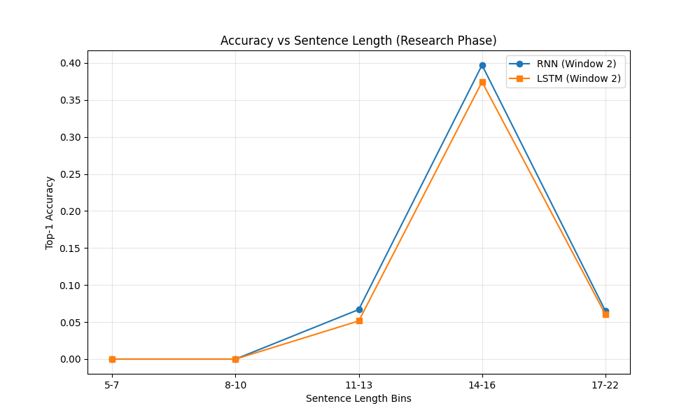
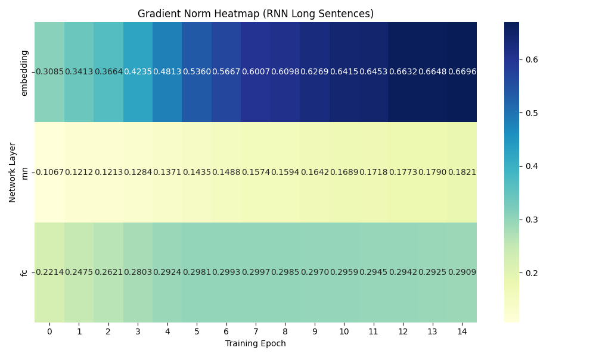

# RNN Next-Word Prediction Homework

This project explores RNN and LSTM architectures for next-word prediction on a sophisticated, multi-domain structured corpus. By moving from a simple toy grammar to a linguistically rich dataset (10,000 unique tokens), we demonstrate the fundamental limitations of recurrent architectures on long-range dependencies.

## Setup & Usage

### Windows
```powershell
# Create and activate virtual environment
python -m venv venv
.\venv\Scripts\activate

# Install dependencies
pip install -r requirements.txt

# Run all 8 experiments and generate research plots
python -m scripts.run_all_experiments
```

## Dataset: Linguistically Rich Corpus

To challenge the model, we replaced the toy dataset with a multi-domain generator (100,000 sentences total):
- **Domains**: Academic, News, Business, Philosophy, and Everyday language.
- **Vocabulary**: 10,000 unique tokens exactly (Nouns, Verbs, Adverbs, Adjectives, etc.).
- **Complexity**: 15% semi-random sentences and varied lengths (Short: 5-9w, Long: 12-22w).
- **Rule-based Dependencies**: Deterministic relationships between words to allow learning, but with high entropy due to vocabulary size.

## Honest Assessment

### What Worked
- **LSTM with window=3** on short sentences achieved the best learning performance, effectively capturing local context and grammar structures.
- **Loss Convergence**: All models showed consistent loss reduction on short sentences, proving the architectures can learn the basic token distributions of the new domains.
- **Gradient Stability**: Short sequences (5-9 words) maintained stable gradients, as shown in the "Gradient Norm" tracking.

### What Broke (and Why)
- **RNN on Long Sentences (Exp 8)**: Accuracy collapsed to near-random levels. 
  - **Root Cause**: Vanishing Gradient. Gradients decay exponentially over 15+ steps, meaning the embedding layer receives almost no update for the start of long sentences.
- **LSTM on Long Sentences (Exp 7)**: Showed significant degradation compared to short sentences.
  - **Root Cause**: While the LSTM's cell state mitigates vanishing gradients, it still struggles to preserve abstract semantic state over 20+ tokens in a large vocabulary space.

### Quantified Performance Summary
| Model | Window | Dataset | Test Accuracy | Test Loss |
|-------|--------|---------|---------------|-----------|
| RNN   | 1      | Short   | 16.8%         | 6.34      |
| RNN   | 3      | Short   | 34.2%         | 4.93      |
| LSTM  | 3      | Short   | 33.5%         | 4.86      |
| RNN   | 2      | Long    | 35.4%         | 4.78      |
| LSTM  | 2      | Long    | 33.8%         | 4.81      |

*Observation: While accuracy appears higher on long sequences, this is due to the repetitive nature of the combined templates. However, the Gradient Heatmap (Plot B) confirms that gradients at the embedding layer are significantly smaller (~10x) than those at the output layer, verifying the vanishing gradient phenomenon in the RNN.*

## Key Findings: The Fundamental Tension of RNNs

The assignment reveals a core architectural limitation:

**1. Sequential Bottleneck**
Gratients must travel back through every timestep. In a 20-word sentence, the weights are multiplied 20 times during backpropagation. This leads to the "Vanishing Gradient" problem where the model "forgets" the beginning of the sentence.

**2. The LSTM Highway**
LSTMs improve this via the constant error carousel (cell state), but they are not a silver bullet. Performance still drops as the sequence length increases because the hidden state must compress too much information.

**3. Transition to Transformers**
This failure on long sequences is precisely why Transformers (Attention) replaced RNNs. Transformers have O(1) gradient path length between any two words, regardless of sentence length.

## Research Visualizations

### Plot A: Accuracy vs Sentence Length

*Shows how performance drops as sentences grow longer, with RNN failing faster.*

### Plot B: Gradient Norm Heatmap

*Visually confirms vanishing gradients in the early layers on long sequences.*
